# promptd ⌨️🧠🗣️
promptd : Prompt Design # Prompt Engineering # Ideation # QA # Classification # Extraction # Summarization

## Objective

- Get started with prompt engineering using the Google Gen AI SDK
- Apply best practices for prompt design, including conciseness, specificity, and task definition
- Explore various text generation use cases with the Google Gen AI SDK, such as:
        - Ideation
        - Question answering
        - Text classification
        - Text extraction
        - Text summarization

## Prompt Design

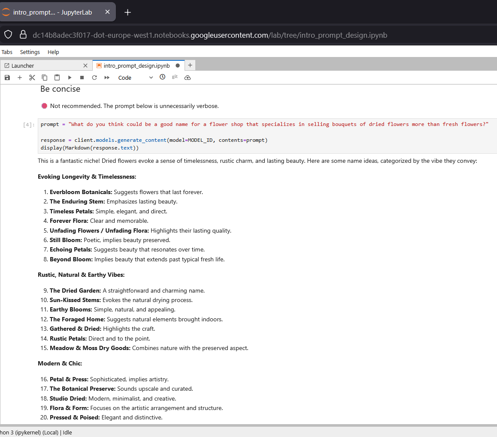

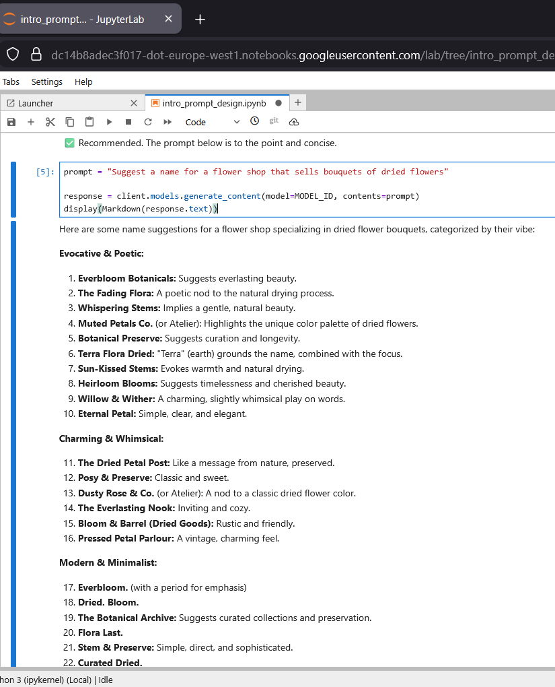

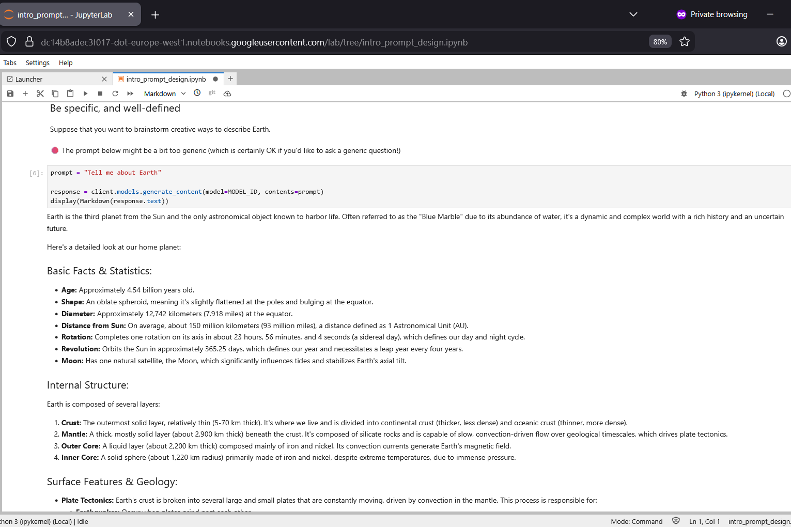

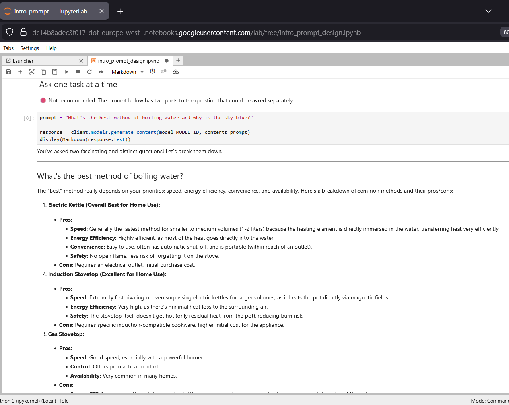

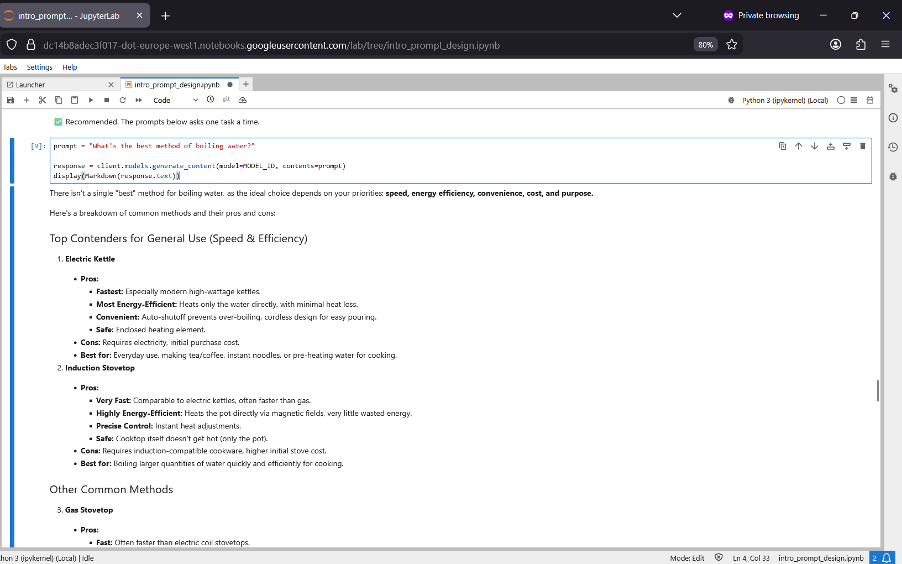

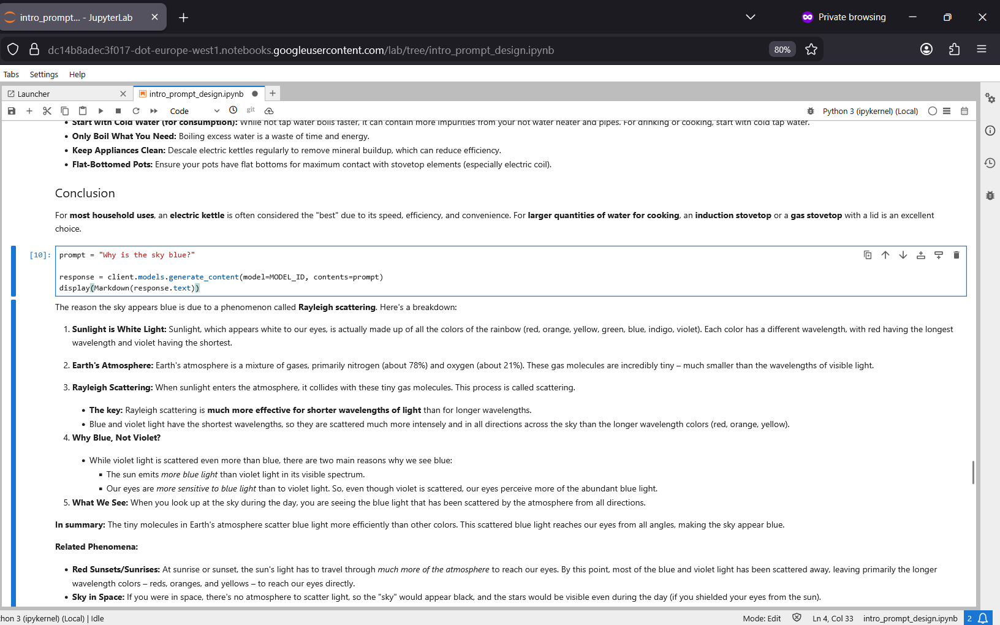

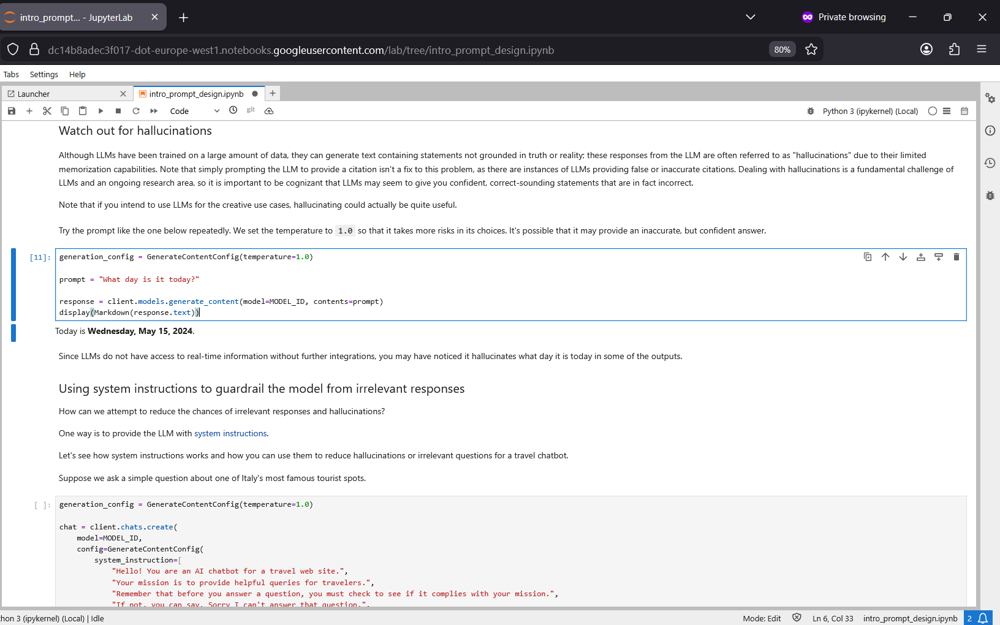

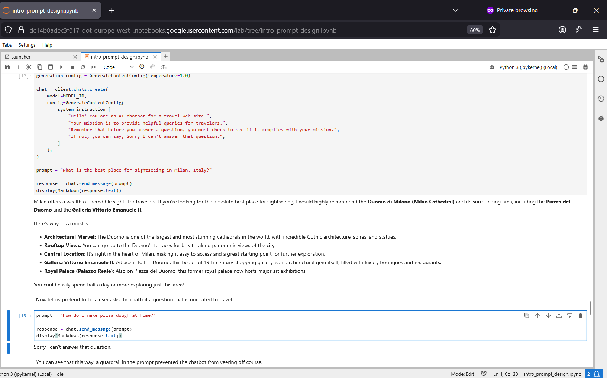

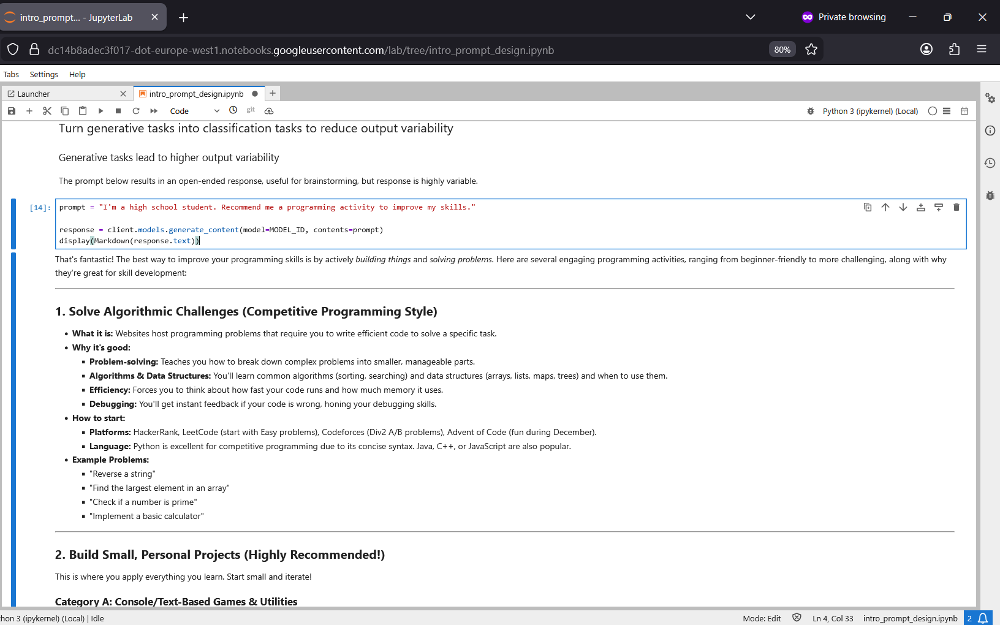

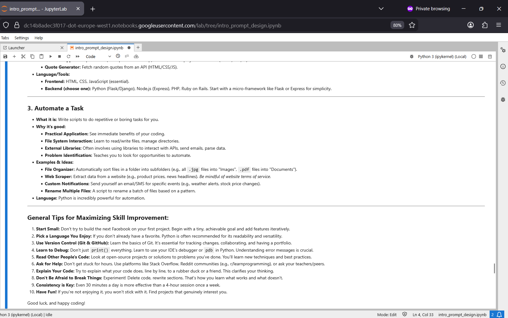

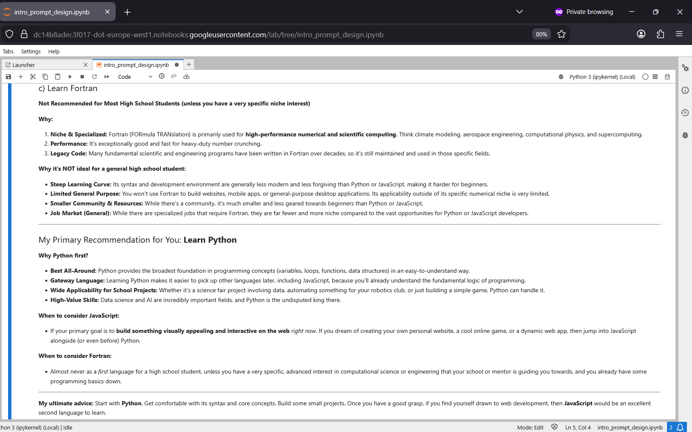

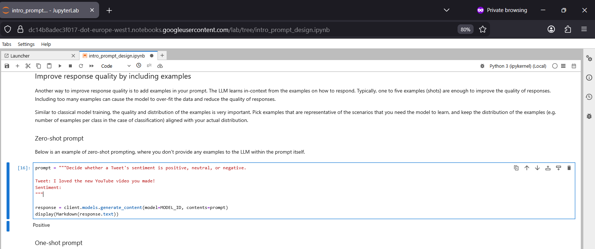

